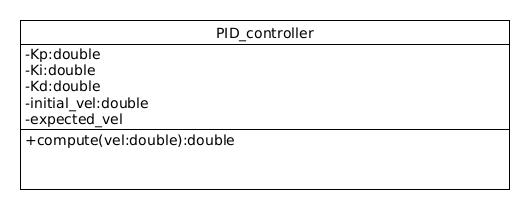

 [](https://codecov.io/gh/Rashmikapu/ENPM808X_TestDrivenDev) [](LICENSE)


## Authors :

-- Driver: RASHMI KAPU (119461754)<br>
-- Navigator: NEHA MADHEKAR (119374436)
## Authors - Part 2 : [](https://codecov.io/gh/Achuthankrishna/ENPM808X_TestDrivenDev)
Navigator: Vyshnav Achuthan (Achuthankrishna) <br> 
Driver: Jerry Pittman, Jr. (jpittma1)
## UML Diagram


## To-Do
1. add test case to validate PID gain values are real and non-zero
2. Add a Test case for checkking non-zero values in the pipeline.
3. Add a test case to check whether current state is greater than target

## Instructions to build and run :

# Configure the project and generate a native build system:
  
  cmake -S ./ -B build/

# Compile and build the project:
  # rebuild only files that are modified since the last build
  cmake --build build/
  # or rebuild everything from scracth
  cmake --build build/ --clean-first
  # to see verbose output, do:
  cmake --build build/ --verbose

# Run program:
  ./build/app/shell-app

# Run tests:
  cd build/; ctest; cd -
  # or if you have newer cmake
  ctest --test-dir build/

# Build docs:
  cmake --build build/ --target docs
  # open a web browser to browse the doc
  open docs/html/index.html

# Clean
  cmake --build build/ --target clean

# Clean and start over:
  rm -rf build/
```

ref: https://cmake.org/cmake/help/latest/manual/cmake.1.html


## Building for code coverage (for assignments beginning in Week 4)

```bash
# if you don't have gcovr or lcov installed, do:
  sudo apt-get install gcovr lcov
# Set the build type to Debug and WANT_COVERAGE=ON
  cmake -D WANT_COVERAGE=ON -D CMAKE_BUILD_TYPE=Debug -S ./ -B build/
# Now, do a clean compile, run unit test, and generate the covereage report
  cmake --build build/ --clean-first --target all test_coverage
# open a web browser to browse the test coverage report
  open build/test_coverage/index.html

This generates a index.html page in the build/test_coverage sub-directory that can be viewed locally in a web browser.
```

You can also get code coverage report for the *shell-app* target, instead of unit test. Repeat the previous 2 steps but with the *app_coverage* target:

``` bash
# Now, do another clean compile, run shell-app, and generate its covereage report
  cmake --build build/ --clean-first --target all app_coverage
# open a web browser to browse the test coverage report
  open build/app_coverage/index.html

This generates a index.html page in the build/app_coverage sub-directory that can be viewed locally in a web browser.
```

